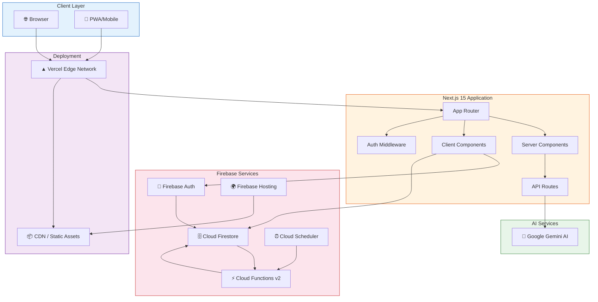
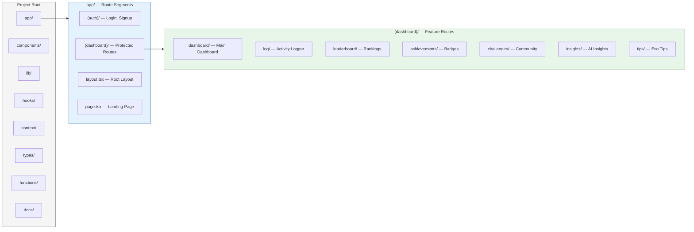
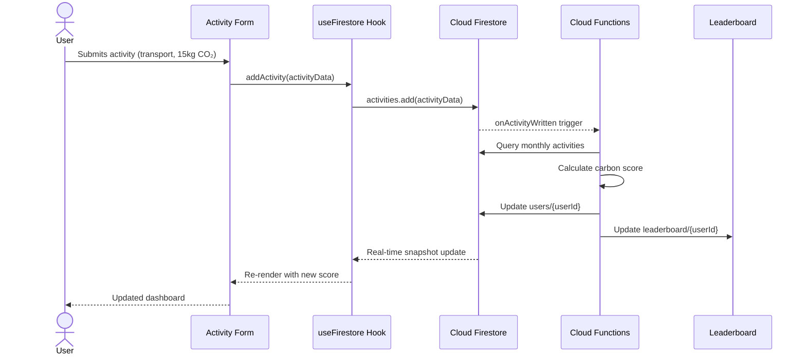
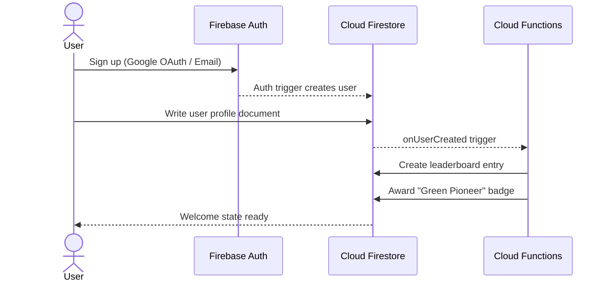
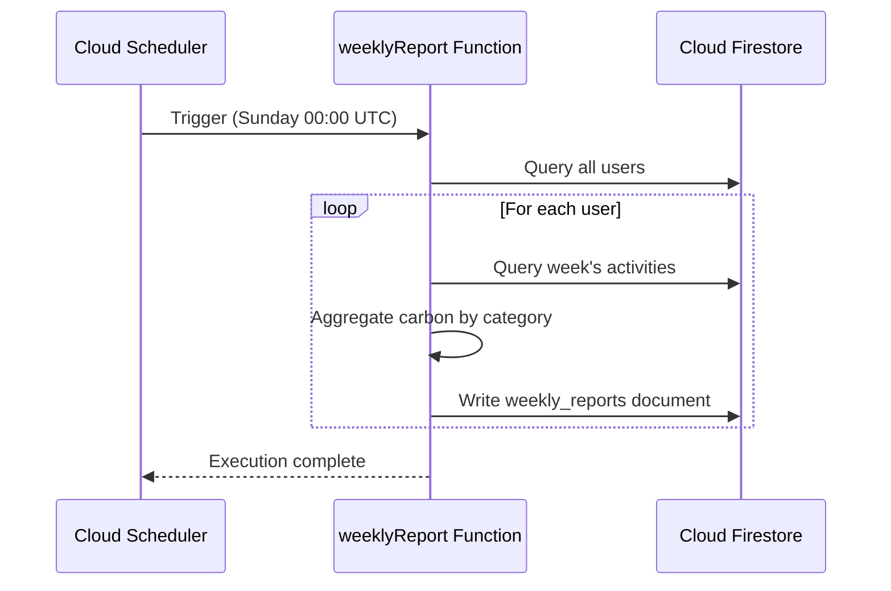
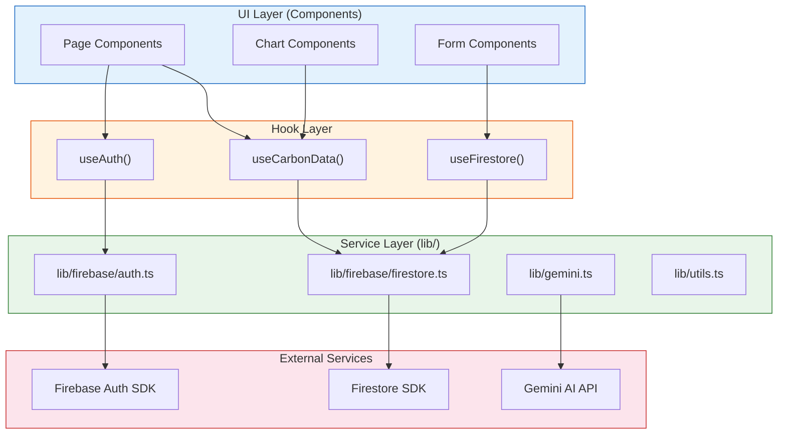
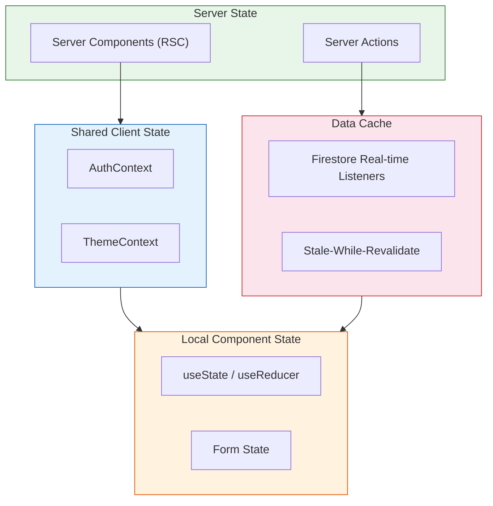
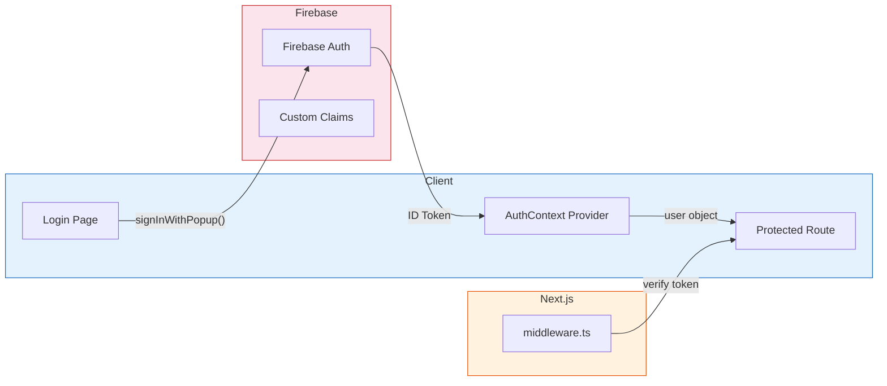
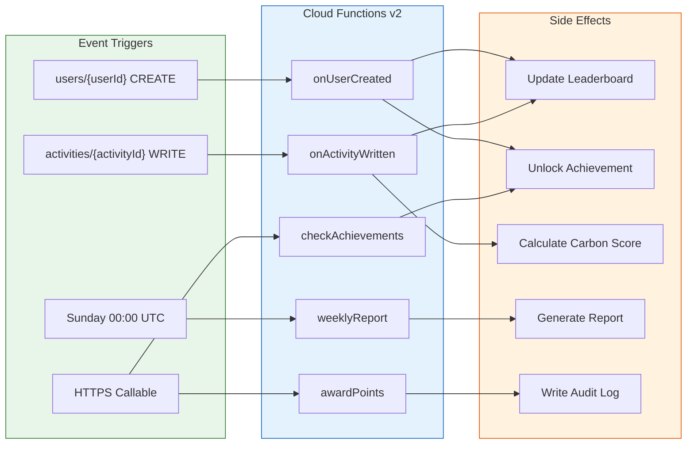

# 🏗️ CarbonMind AI — Architecture Documentation

> Comprehensive system architecture guide for the CarbonMind AI platform.

---

## Table of Contents

- [System Architecture Overview](#system-architecture-overview)
- [High-Level Architecture Diagram](#high-level-architecture-diagram)
- [Feature-First Folder Structure](#feature-first-folder-structure)
- [Data Flow Diagrams](#data-flow-diagrams)
- [Service Layer Architecture](#service-layer-architecture)
- [State Management Approach](#state-management-approach)
- [Authentication Architecture](#authentication-architecture)
- [Cloud Functions Pipeline](#cloud-functions-pipeline)
- [Rendering Strategy](#rendering-strategy)

---

## System Architecture Overview

CarbonMind AI follows a **modern JAMstack architecture** built on Next.js 15 with the App Router, Firebase as the Backend-as-a-Service (BaaS), and Google Gemini AI for intelligent carbon insights.

### Key Architectural Decisions

| Decision | Rationale |
|----------|-----------|
| **Next.js 15 App Router** | Server components, streaming SSR, built-in API routes, and optimized bundling |
| **Firebase BaaS** | Zero-ops backend with real-time database, authentication, and serverless functions |
| **Cloud Functions v2** | Event-driven architecture for data consistency and automated reporting |
| **Feature-first structure** | Colocation of related logic, improved maintainability and developer experience |
| **TypeScript strict mode** | Compile-time type safety across the entire codebase |
| **Tailwind CSS** | Utility-first styling with design system consistency and minimal CSS bundle |

---

## High-Level Architecture Diagram

---

## Feature-First Folder Structure

CarbonMind AI uses a **feature-first** directory organization where related files (routes, components, hooks, types) are colocated by domain concern.

### Directory Responsibilities

| Directory | Responsibility | Key Files |
|-----------|---------------|-----------|
| `app/` | Next.js route definitions and page components | `layout.tsx`, `page.tsx`, route groups |
| `components/` | Reusable React components organized by domain | `ui/`, `charts/`, `layout/`, `forms/` |
| `lib/` | Service layer, utilities, and third-party integrations | `firebase/`, `gemini.ts`, `utils.ts` |
| `hooks/` | Custom React hooks for data fetching and state | `useAuth.ts`, `useCarbonData.ts` |
| `context/` | React Context providers for global state | `AuthContext.tsx` |
| `types/` | TypeScript interfaces and type definitions | `index.ts` |
| `functions/` | Firebase Cloud Functions (TypeScript, separate build) | `src/index.ts` |
| `docs/` | Project documentation and guides | `ARCHITECTURE.md`, `SECURITY.md` |

---

## Data Flow Diagrams

### Activity Logging Flow

### User Registration Flow

### Weekly Report Generation

---

## Service Layer Architecture

The service layer in `lib/` provides a clean abstraction over Firebase services, preventing direct SDK calls from UI components.

### Service Module Details

#### `lib/firebase/config.ts`
Initializes the Firebase app singleton. Ensures only one Firebase instance exists across the application lifecycle.

#### `lib/firebase/auth.ts`
Provides authentication utilities:
- `signInWithGoogle()` — OAuth popup flow
- `signInWithEmail(email, password)` — Email/password login
- `signUp(email, password, name)` — New user registration
- `signOut()` — Session termination
- `onAuthStateChanged(callback)` — Auth state observer

#### `lib/firebase/firestore.ts`
Encapsulates all Firestore CRUD operations:
- `addActivity(userId, activityData)` — Log a carbon activity
- `getUserActivities(userId, dateRange)` — Query user activities
- `getLeaderboard(limit)` — Fetch ranked leaderboard
- `getUserAchievements(userId)` — Get unlocked badges
- `updateUserProfile(userId, data)` — Update user metadata

#### `lib/gemini.ts`
Integrates Google Gemini AI for personalized insights:
- `generateCarbonInsights(userData)` — AI analysis of carbon patterns
- `getEcoRecommendations(activities)` — Personalized reduction tips
- `analyzeCarbonTrend(history)` — Trend analysis and projections

---

## State Management Approach

CarbonMind uses a **layered state management** strategy optimized for the Next.js App Router:

### State Categories

| Category | Tool | Use Case |
|----------|------|----------|
| **Server State** | React Server Components | Initial page data, SEO content, static queries |
| **Auth State** | `AuthContext` + `useAuth` | User session, auth status, user profile |
| **Theme State** | `ThemeContext` | Light/dark mode preference |
| **Form State** | `useState` / controlled components | Activity form inputs, search filters |
| **Real-time Data** | Firestore `onSnapshot` | Leaderboard updates, live carbon score |
| **Cached Data** | React cache / custom hooks | Activity history, achievement list |

### Why Not Redux/Zustand?

CarbonMind deliberately avoids a global state management library because:

1. **Firebase provides real-time state** — Firestore listeners serve as the single source of truth for most application data
2. **React Context is sufficient** — Only auth and theme state need to be globally shared
3. **Server Components reduce client state** — Next.js 15 RSC handles data fetching on the server, eliminating the need for client-side caching of static data
4. **Simplicity** — Fewer dependencies, smaller bundle, and easier onboarding for new contributors

---

## Authentication Architecture

---

## Cloud Functions Pipeline

---

## Rendering Strategy

| Route | Strategy | Rationale |
|-------|----------|-----------|
| `/` (Landing) | **SSG** | Static marketing page, maximum performance |
| `/login`, `/signup` | **CSR** | Firebase Auth SDK requires client-side rendering |
| `/dashboard` | **SSR + CSR Hybrid** | Initial data server-rendered, real-time updates client-side |
| `/leaderboard` | **SSR + Real-time** | Server-rendered initial load, Firestore listener for live updates |
| `/log` | **CSR** | Interactive form with client-side validation |
| `/achievements` | **SSR** | Achievement data fetched on server, rarely changes |
| `/insights` | **CSR** | Gemini AI API calls happen client-side with streaming |
| `/tips` | **SSG + ISR** | Static content with incremental regeneration |

---

  <em>Last updated: June 2025</em>

