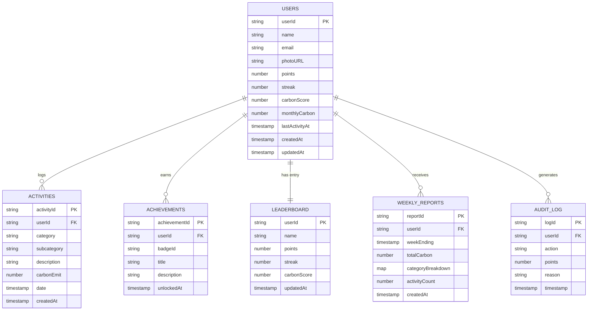
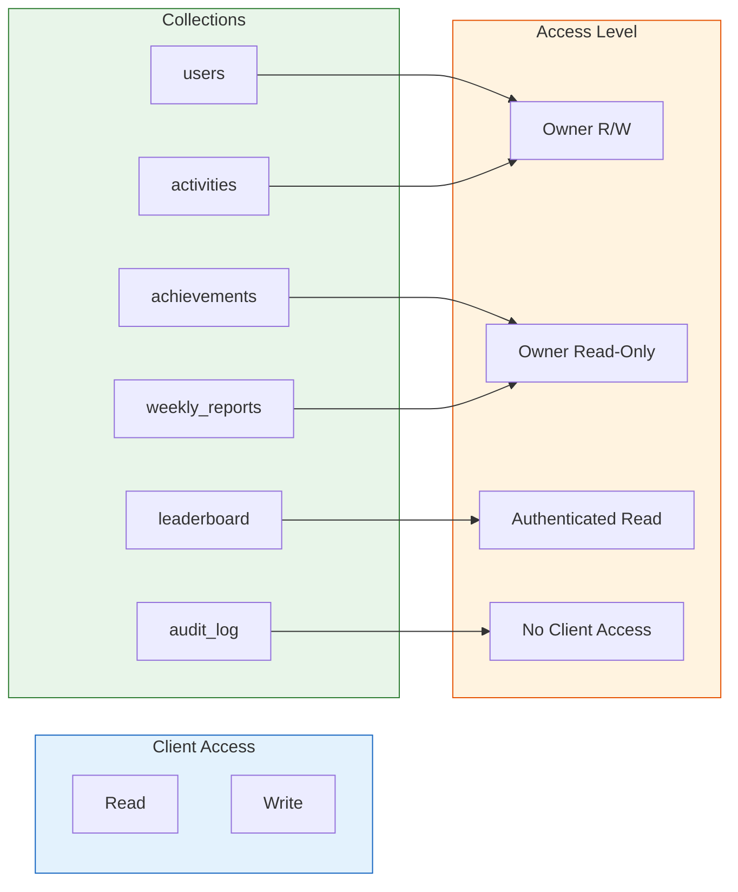
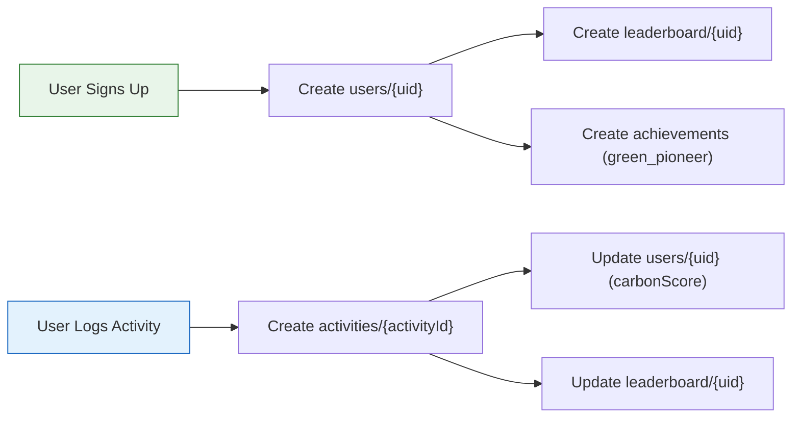

# 🗄️ CarbonMind AI — Database Schema Documentation

> Complete Firestore database schema, document structures, indexing strategy, and security rules for the CarbonMind AI platform.

---

## Table of Contents

- [Database Overview](#database-overview)
- [Collections](#collections)
  - [users](#users-collection)
  - [activities](#activities-collection)
  - [achievements](#achievements-collection)
  - [leaderboard](#leaderboard-collection)
  - [weekly_reports](#weekly_reports-collection)
  - [audit_log](#audit_log-collection)
- [Entity Relationship Diagram](#entity-relationship-diagram)
- [Indexes](#indexes)
- [Security Rules](#security-rules)
- [Data Access Patterns](#data-access-patterns)
- [Data Lifecycle](#data-lifecycle)

---

## Database Overview

CarbonMind AI uses **Cloud Firestore** as its primary database — a serverless, NoSQL document database with real-time synchronization, offline support, and automatic scaling.

### Why Firestore?

| Requirement | Firestore Capability |
|-------------|---------------------|
| Real-time leaderboard updates | `onSnapshot` real-time listeners |
| Offline activity logging | Built-in offline persistence |
| Serverless scaling | Automatic horizontal scaling |
| Document-level security | Granular security rules |
| Low-latency reads | Global multi-region replication |
| Event-driven functions | Native Cloud Functions triggers |

### Database Configuration

| Setting | Value |
|---------|-------|
| **Project ID** | `cardon-footprint` |
| **Location** | Multi-region (nam5) |
| **Mode** | Native mode |
| **Concurrency** | Optimistic with automatic retries |

---

## Collections

### `users` Collection

Stores user profiles and aggregate carbon metrics. Created on first authentication.

**Path:** `users/{userId}`

| Field | Type | Required | Default | Description |
|-------|------|----------|---------|-------------|
| `name` | `string` | Yes | — | User's display name |
| `email` | `string` | Yes | — | User's email address |
| `photoURL` | `string` | No | `null` | Profile image URL from OAuth provider |
| `points` | `number` | Yes | `50` | Total eco points accumulated |
| `streak` | `number` | Yes | `0` | Consecutive days of activity logging |
| `carbonScore` | `number` | Yes | `75` | Carbon score (0–100, higher is better) |
| `monthlyCarbon` | `number` | No | `0` | Total carbon emissions for the current month (kg) |
| `lastActivityAt` | `timestamp` | No | `null` | Timestamp of most recent activity |
| `createdAt` | `timestamp` | Yes | Server timestamp | Account creation timestamp |
| `updatedAt` | `timestamp` | Yes | Server timestamp | Last profile update timestamp |

**Example Document:**

```json
{
  "name": "Jane Doe",
  "email": "jane.doe@example.com",
  "photoURL": "https://lh3.googleusercontent.com/a/photo",
  "points": 320,
  "streak": 5,
  "carbonScore": 82,
  "monthlyCarbon": 108.5,
  "lastActivityAt": "2025-06-10T14:30:00Z",
  "createdAt": "2025-01-15T08:00:00Z",
  "updatedAt": "2025-06-10T14:30:00Z"
}
```

**Write Sources:**

| Operation | Source | Trigger |
|-----------|--------|---------|
| Create | Client (sign-up flow) | User registration |
| Update (`points`) | Cloud Function (`awardPoints`) | Points awarded |
| Update (`carbonScore`, `monthlyCarbon`) | Cloud Function (`onActivityWritten`) | Activity logged |
| Update (`streak`) | Client or Cloud Function | Daily login / activity check |

---

### `activities` Collection

Stores individual carbon-emitting activities logged by users.

**Path:** `activities/{activityId}`

| Field | Type | Required | Default | Description |
|-------|------|----------|---------|-------------|
| `userId` | `string` | Yes | — | Reference to the user who logged this activity |
| `category` | `string` | Yes | — | Activity category: `transport`, `energy`, `food`, `consumption`, `waste` |
| `subcategory` | `string` | No | `null` | Specific activity type (e.g., `car`, `flight`, `electricity`) |
| `description` | `string` | No | `""` | User-provided description of the activity |
| `carbonEmit` | `number` | Yes | — | Carbon emission in kilograms of CO₂ |
| `date` | `timestamp` | Yes | — | Date the activity occurred |
| `createdAt` | `timestamp` | Yes | Server timestamp | Document creation timestamp |

**Category Enum:**

| Category | Icon | Example Activities |
|----------|------|--------------------|
| `transport` | 🚗 | Driving, flying, public transit, cycling |
| `energy` | ⚡ | Electricity usage, heating, cooling |
| `food` | 🍽️ | Meat consumption, dairy, plant-based meals |
| `consumption` | 🛒 | Shopping, electronics, clothing |
| `waste` | 🗑️ | Recycling, composting, landfill waste |

**Example Document:**

```json
{
  "userId": "abc123def456",
  "category": "transport",
  "subcategory": "car",
  "description": "Daily commute to office",
  "carbonEmit": 8.5,
  "date": "2025-06-10T00:00:00Z",
  "createdAt": "2025-06-10T09:15:00Z"
}
```

**Write Sources:**

| Operation | Source | Trigger |
|-----------|--------|---------|
| Create | Client (activity form) | User logs an activity |
| Update | Client (edit activity) | User corrects an entry |
| Delete | Client (delete action) | User removes an entry |

---

### `achievements` Collection

Stores unlocked achievements/badges for each user. Written exclusively by Cloud Functions.

**Path:** `achievements/{achievementId}`

| Field | Type | Required | Default | Description |
|-------|------|----------|---------|-------------|
| `userId` | `string` | Yes | — | Reference to the user who earned the achievement |
| `badgeId` | `string` | Yes | — | Unique identifier for the badge type |
| `title` | `string` | Yes | — | Human-readable badge title |
| `description` | `string` | Yes | — | Description of how the badge was earned |
| `unlockedAt` | `timestamp` | Yes | Server timestamp | When the achievement was unlocked |

**Available Badges:**

| Badge ID | Title | Criteria |
|----------|-------|----------|
| `green_pioneer` | Green Pioneer | Awarded on user registration |
| `streak_3` | 3-Day Streak | Log activities 3 consecutive days |
| `streak_7` | Week Warrior | Log activities 7 consecutive days |
| `eco_champion` | Eco Champion | Achieve a carbon score of 80+ |
| `points_500` | Eco Elite | Accumulate 500 eco points |

**Example Document:**

```json
{
  "userId": "abc123def456",
  "badgeId": "streak_7",
  "title": "Week Warrior",
  "description": "A full week of carbon tracking!",
  "unlockedAt": "2025-06-10T00:00:00Z"
}
```

**Write Sources:**

| Operation | Source | Trigger |
|-----------|--------|---------|
| Create | Cloud Function (`onUserCreated`) | New user welcome badge |
| Create | Cloud Function (`checkAchievements`) | Milestone reached |

---

### `leaderboard` Collection

Stores ranked user scores for the community leaderboard. Written exclusively by Cloud Functions.

**Path:** `leaderboard/{userId}`

| Field | Type | Required | Default | Description |
|-------|------|----------|---------|-------------|
| `userId` | `string` | Yes | — | Reference to the user (same as document ID) |
| `name` | `string` | Yes | — | User's display name |
| `points` | `number` | Yes | `50` | Total eco points |
| `streak` | `number` | Yes | `0` | Current consecutive-day streak |
| `carbonScore` | `number` | Yes | `75` | Carbon score (0–100) |
| `updatedAt` | `timestamp` | Yes | Server timestamp | Last update timestamp |

**Example Document:**

```json
{
  "userId": "abc123def456",
  "name": "Jane Doe",
  "points": 320,
  "streak": 5,
  "carbonScore": 82,
  "updatedAt": "2025-06-10T14:30:00Z"
}
```

**Write Sources:**

| Operation | Source | Trigger |
|-----------|--------|---------|
| Create | Cloud Function (`onUserCreated`) | New user registered |
| Update (`carbonScore`) | Cloud Function (`onActivityWritten`) | Activity aggregated |
| Update (`points`) | Cloud Function (`awardPoints`) | Points awarded |

---

### `weekly_reports` Collection

Stores auto-generated weekly carbon summaries. Written exclusively by the `weeklyReport` scheduled Cloud Function.

**Path:** `weekly_reports/{reportId}`

| Field | Type | Required | Default | Description |
|-------|------|----------|---------|-------------|
| `userId` | `string` | Yes | — | Reference to the user |
| `weekEnding` | `timestamp` | Yes | — | End date of the reporting week |
| `totalCarbon` | `number` | Yes | — | Total carbon emissions for the week (kg CO₂) |
| `categoryBreakdown` | `map` | Yes | — | Emissions breakdown by category |
| `activityCount` | `number` | Yes | — | Number of activities logged during the week |
| `createdAt` | `timestamp` | Yes | Server timestamp | Report generation timestamp |

**`categoryBreakdown` Map Structure:**

```json
{
  "transport": 45.2,
  "energy": 22.1,
  "food": 18.5,
  "consumption": 8.0,
  "waste": 3.7
}
```

**Example Document:**

```json
{
  "userId": "abc123def456",
  "weekEnding": "2025-06-08T00:00:00Z",
  "totalCarbon": 97.5,
  "categoryBreakdown": {
    "transport": 45.2,
    "energy": 22.1,
    "food": 18.5,
    "consumption": 8.0,
    "waste": 3.7
  },
  "activityCount": 12,
  "createdAt": "2025-06-08T00:01:15Z"
}
```

**Write Sources:**

| Operation | Source | Trigger |
|-----------|--------|---------|
| Create | Cloud Function (`weeklyReport`) | Scheduled every Sunday 00:00 UTC |

---

### `audit_log` Collection

Stores security audit entries for sensitive operations. Server-only access — no client reads or writes.

**Path:** `audit_log/{logId}`

| Field | Type | Required | Default | Description |
|-------|------|----------|---------|-------------|
| `userId` | `string` | Yes | — | User who performed the action |
| `action` | `string` | Yes | — | Action type identifier |
| `points` | `number` | No | — | Points involved (if applicable) |
| `reason` | `string` | No | — | Reason for the action |
| `timestamp` | `timestamp` | Yes | Server timestamp | When the action occurred |

**Action Types:**

| Action | Description |
|--------|-------------|
| `points_awarded` | Eco points awarded to a user |

**Example Document:**

```json
{
  "userId": "abc123def456",
  "action": "points_awarded",
  "points": 10,
  "reason": "daily_login",
  "timestamp": "2025-06-10T08:00:00Z"
}
```

**Write Sources:**

| Operation | Source | Trigger |
|-----------|--------|---------|
| Create | Cloud Function (`awardPoints`) | Points awarded to user |

---

## Entity Relationship Diagram



---

## Indexes

### Composite Indexes

Firestore requires composite indexes for queries that combine equality filters with inequality or ordering across different fields.

| Collection | Fields | Order | Query Pattern |
|------------|--------|-------|---------------|
| `activities` | `userId` (ASC), `date` (DESC) | Query + Order | Get user activities sorted by date |
| `activities` | `userId` (ASC), `date` (ASC) | Query + Range | Get user activities in a date range |
| `activities` | `userId` (ASC), `category` (ASC), `date` (DESC) | Query + Filter + Order | Get user activities filtered by category |
| `achievements` | `userId` (ASC), `unlockedAt` (DESC) | Query + Order | Get user achievements newest first |
| `weekly_reports` | `userId` (ASC), `weekEnding` (DESC) | Query + Order | Get user reports newest first |
| `leaderboard` | `carbonScore` (DESC) | Order | Global leaderboard ranking by score |
| `leaderboard` | `points` (DESC) | Order | Global leaderboard ranking by points |

### Firestore Index Definition

```json
{
  "indexes": [
    {
      "collectionGroup": "activities",
      "queryScope": "COLLECTION",
      "fields": [
        { "fieldPath": "userId", "order": "ASCENDING" },
        { "fieldPath": "date", "order": "DESCENDING" }
      ]
    },
    {
      "collectionGroup": "activities",
      "queryScope": "COLLECTION",
      "fields": [
        { "fieldPath": "userId", "order": "ASCENDING" },
        { "fieldPath": "date", "order": "ASCENDING" }
      ]
    },
    {
      "collectionGroup": "activities",
      "queryScope": "COLLECTION",
      "fields": [
        { "fieldPath": "userId", "order": "ASCENDING" },
        { "fieldPath": "category", "order": "ASCENDING" },
        { "fieldPath": "date", "order": "DESCENDING" }
      ]
    },
    {
      "collectionGroup": "achievements",
      "queryScope": "COLLECTION",
      "fields": [
        { "fieldPath": "userId", "order": "ASCENDING" },
        { "fieldPath": "unlockedAt", "order": "DESCENDING" }
      ]
    },
    {
      "collectionGroup": "weekly_reports",
      "queryScope": "COLLECTION",
      "fields": [
        { "fieldPath": "userId", "order": "ASCENDING" },
        { "fieldPath": "weekEnding", "order": "DESCENDING" }
      ]
    }
  ],
  "fieldOverrides": []
}
```

### Single-Field Indexes

Firestore automatically creates single-field indexes for every field. The following single-field indexes are particularly important:

| Collection | Field | Usage |
|------------|-------|-------|
| `leaderboard` | `carbonScore` | Leaderboard ranking queries |
| `leaderboard` | `points` | Points-based ranking |
| `activities` | `userId` | Filter activities by user |
| `achievements` | `userId` | Filter achievements by user |
| `audit_log` | `timestamp` | Chronological audit queries |

---

## Security Rules

### Access Control Summary



### Access Matrix

| Collection | Client Read | Client Create | Client Update | Client Delete | Server Write |
|------------|-------------|---------------|---------------|---------------|--------------|
| `users` | Owner | Owner | Owner (restricted) | ❌ | ✅ (Functions) |
| `activities` | Owner | Owner | Owner | Owner | ✅ (Functions) |
| `achievements` | Owner | ❌ | ❌ | ❌ | ✅ (Functions) |
| `leaderboard` | All authenticated | ❌ | ❌ | ❌ | ✅ (Functions) |
| `weekly_reports` | Owner | ❌ | ❌ | ❌ | ✅ (Functions) |
| `audit_log` | ❌ | ❌ | ❌ | ❌ | ✅ (Functions) |

### Key Security Principles

1. **Ownership validation**: Users can only read/write their own documents (enforced by `request.auth.uid == userId`)
2. **Server-only writes for sensitive data**: Leaderboard, achievements, reports, and audit logs can only be written by Cloud Functions using the Admin SDK (bypasses security rules)
3. **Field-level restrictions**: Users cannot modify protected fields like `role` or `createdAt` on their profile
4. **Input constraints**: Firestore rules validate field types and ranges (e.g., `carbonEmit` must be 0–10,000)
5. **Default deny**: All paths not explicitly allowed are denied by the catch-all rule

---

## Data Access Patterns

### Common Query Patterns

| Query | Collection | Filters | Index Required |
|-------|------------|---------|----------------|
| Get user profile | `users` | `doc(userId)` | No (document lookup) |
| Get user's monthly activities | `activities` | `userId == X`, `date >= startOfMonth` | Yes (composite) |
| Get user's activities by category | `activities` | `userId == X`, `category == Y`, ordered by `date` | Yes (composite) |
| Get top 10 leaderboard | `leaderboard` | Ordered by `carbonScore` DESC, limit 10 | Yes (single-field) |
| Get user's achievements | `achievements` | `userId == X`, ordered by `unlockedAt` DESC | Yes (composite) |
| Get latest weekly report | `weekly_reports` | `userId == X`, ordered by `weekEnding` DESC, limit 1 | Yes (composite) |
| Real-time leaderboard | `leaderboard` | `onSnapshot`, ordered by `carbonScore` DESC | Yes (single-field) |

### Read Optimization Strategies

| Strategy | Implementation | Benefit |
|----------|---------------|---------|
| **Document caching** | Firestore SDK built-in cache | Reduced reads and offline support |
| **Query cursors** | `startAfter()` for pagination | Efficient large result sets |
| **Field projection** | `select()` specific fields | Reduced bandwidth |
| **Batched reads** | `getAll()` for multiple documents | Reduced round trips |
| **Real-time listeners** | `onSnapshot()` for live data | No polling overhead |

### Write Optimization Strategies

| Strategy | Implementation | Benefit |
|----------|---------------|---------|
| **Batched writes** | `writeBatch()` for multi-doc updates | Atomic operations, reduced latency |
| **Server timestamps** | `serverTimestamp()` for time fields | Consistent timestamps across clients |
| **Increment operations** | `FieldValue.increment()` for counters | Avoids read-modify-write race conditions |
| **Debounced writes** | Client-side throttling | Prevents excessive write costs |

---

## Data Lifecycle

### Document Creation



### Data Retention

| Collection | Retention Policy | Rationale |
|------------|-----------------|-----------|
| `users` | Permanent (until account deletion) | Core user profile data |
| `activities` | Permanent | Historical tracking and trend analysis |
| `achievements` | Permanent | Earned achievements are never revoked |
| `leaderboard` | Permanent (updated in place) | Single document per user, always current |
| `weekly_reports` | 52 weeks (1 year) | Rolling annual history |
| `audit_log` | 90 days | Compliance and debugging window |

### Data Deletion (Account Removal)

When a user deletes their account, the following cleanup occurs:

1. Delete `users/{userId}` document
2. Delete all `activities` where `userId == userId`
3. Delete all `achievements` where `userId == userId`
4. Delete `leaderboard/{userId}` document
5. Delete all `weekly_reports` where `userId == userId`
6. Audit log entries are retained for the compliance retention period

---

<p align="center">
  <em>Last updated: June 2025</em>
</p>
