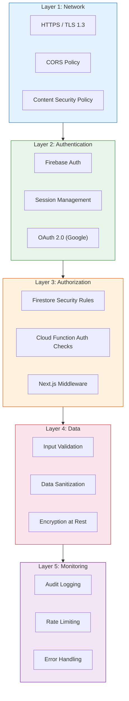
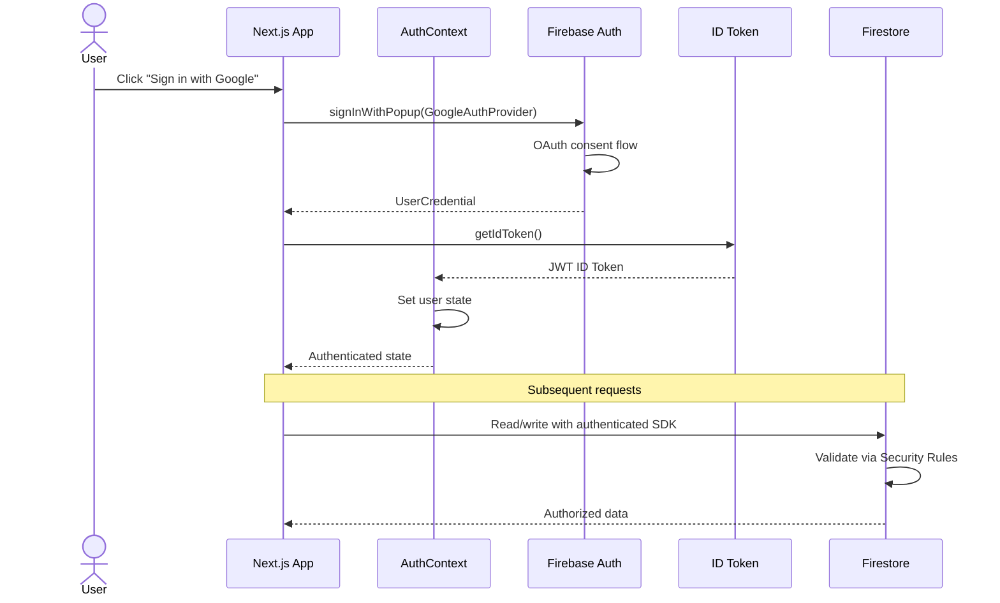

# 🔒 CarbonMind AI — Security Documentation

> Comprehensive security practices, policies, and implementation details for the CarbonMind AI platform.

---

## Table of Contents

- [Security Overview](#security-overview)
- [Authentication Flow](#authentication-flow)
- [Firestore Security Rules](#firestore-security-rules)
- [Input Validation](#input-validation)
- [API Security Measures](#api-security-measures)
- [Environment Variable Management](#environment-variable-management)
- [Rate Limiting Strategy](#rate-limiting-strategy)
- [Data Protection](#data-protection)
- [Security Checklist](#security-checklist)

---

## Security Overview

CarbonMind AI implements a **defense-in-depth** security model with multiple layers of protection:



---

## Authentication Flow

### Supported Authentication Methods

| Method | Provider | Use Case |
|--------|----------|----------|
| **Google OAuth 2.0** | Firebase Auth | Primary sign-in for ease of use |
| **Email/Password** | Firebase Auth | Fallback for users without Google accounts |

### Authentication Flow Diagram



### Session Management

- **Token-based sessions**: Firebase ID tokens are JWTs with a 1-hour expiration
- **Auto-refresh**: The Firebase SDK automatically refreshes tokens before expiration
- **Persistent sessions**: Auth state persists across browser sessions using `browserLocalPersistence`
- **Sign-out cleanup**: All listeners are detached and local state is cleared on sign-out

```typescript
// Session persistence configuration
import { setPersistence, browserLocalPersistence } from "firebase/auth";
await setPersistence(auth, browserLocalPersistence);
```

### Protected Route Pattern

```typescript
// middleware.ts — Route protection
export function middleware(request: NextRequest) {
  const authCookie = request.cookies.get("__session");
  const isAuthPage = request.nextUrl.pathname.startsWith("/login");
  const isProtectedPage = request.nextUrl.pathname.startsWith("/dashboard");

  if (isProtectedPage && !authCookie) {
    return NextResponse.redirect(new URL("/login", request.url));
  }

  if (isAuthPage && authCookie) {
    return NextResponse.redirect(new URL("/dashboard", request.url));
  }
}
```

---

## Firestore Security Rules

### Rule Philosophy

CarbonMind follows the **principle of least privilege**: every document operation is denied by default and only explicitly allowed paths are accessible.

### Complete Security Rules

```javascript
rules_version = '2';
service cloud.firestore {
  match /databases/{database}/documents {

    // --- Helper Functions ---

    // Check if the requesting user is authenticated
    function isAuthenticated() {
      return request.auth != null;
    }

    // Check if the user is accessing their own document
    function isOwner(userId) {
      return isAuthenticated() && request.auth.uid == userId;
    }

    // Validate that a string field exists and is not empty
    function isNonEmptyString(field) {
      return field is string && field.size() > 0;
    }

    // Validate that a number field is within a range
    function isInRange(field, min, max) {
      return field is number && field >= min && field <= max;
    }

    // --- Users Collection ---
    match /users/{userId} {
      // Users can read their own profile
      allow read: if isOwner(userId);

      // Users can create their own profile
      allow create: if isOwner(userId)
        && isNonEmptyString(request.resource.data.name)
        && isNonEmptyString(request.resource.data.email);

      // Users can update their own profile (restricted fields)
      allow update: if isOwner(userId)
        && !request.resource.data.diff(resource.data).affectedKeys()
            .hasAny(['role', 'createdAt']);

      // Users cannot delete their own profile (admin only)
      allow delete: if false;
    }

    // --- Activities Collection ---
    match /activities/{activityId} {
      // Users can read their own activities
      allow read: if isAuthenticated()
        && resource.data.userId == request.auth.uid;

      // Users can create activities for themselves
      allow create: if isAuthenticated()
        && request.resource.data.userId == request.auth.uid
        && isNonEmptyString(request.resource.data.category)
        && isInRange(request.resource.data.carbonEmit, 0, 10000);

      // Users can update their own activities
      allow update: if isAuthenticated()
        && resource.data.userId == request.auth.uid
        && request.resource.data.userId == request.auth.uid;

      // Users can delete their own activities
      allow delete: if isAuthenticated()
        && resource.data.userId == request.auth.uid;
    }

    // --- Achievements Collection ---
    match /achievements/{achievementId} {
      // Users can read their own achievements
      allow read: if isAuthenticated()
        && resource.data.userId == request.auth.uid;

      // Only Cloud Functions can write achievements
      allow write: if false;
    }

    // --- Leaderboard Collection ---
    match /leaderboard/{userId} {
      // Leaderboard is publicly readable (for rankings)
      allow read: if isAuthenticated();

      // Only Cloud Functions can write leaderboard entries
      allow write: if false;
    }

    // --- Weekly Reports Collection ---
    match /weekly_reports/{reportId} {
      // Users can read their own reports
      allow read: if isAuthenticated()
        && resource.data.userId == request.auth.uid;

      // Only Cloud Functions can write reports
      allow write: if false;
    }

    // --- Audit Log Collection ---
    match /audit_log/{logId} {
      // No client-side access (server-only)
      allow read, write: if false;
    }

    // --- Default: Deny All ---
    match /{document=**} {
      allow read, write: if false;
    }
  }
}
```

### Security Rules Summary

| Collection | Read | Create | Update | Delete |
|------------|------|--------|--------|--------|
| `users` | Owner only | Owner only | Owner (restricted) | Denied |
| `activities` | Owner only | Owner only | Owner only | Owner only |
| `achievements` | Owner only | Server only | Server only | Server only |
| `leaderboard` | All authenticated | Server only | Server only | Server only |
| `weekly_reports` | Owner only | Server only | Server only | Server only |
| `audit_log` | Denied | Server only | Denied | Denied |

---

## Input Validation

### Client-Side Validation

All form inputs are validated before submission to provide immediate user feedback:

```typescript
// Activity form validation schema
const activitySchema = {
  category: {
    required: true,
    enum: ["transport", "energy", "food", "consumption", "waste"],
  },
  carbonEmit: {
    required: true,
    type: "number",
    min: 0,
    max: 10000,
  },
  description: {
    required: false,
    type: "string",
    maxLength: 500,
  },
  date: {
    required: true,
    type: "date",
    max: "today", // Cannot log future activities
  },
};
```

### Server-Side Validation (Cloud Functions)

All Cloud Functions perform independent validation regardless of client-side checks:

```typescript
// Example: awardPoints validation
if (!request.auth) {
  throw new HttpsError("unauthenticated", "Must be authenticated");
}

const { points, reason } = request.data;
if (typeof points !== "number" || points < 0 || points > 100) {
  throw new HttpsError("invalid-argument", "Points must be 0-100");
}
```

### Validation Rules

| Field | Client Validation | Server Validation | Firestore Rules |
|-------|-------------------|-------------------|-----------------|
| `category` | Enum check | Enum check | `isNonEmptyString` |
| `carbonEmit` | Range (0-10000) | Range (0-10000) | `isInRange(0, 10000)` |
| `points` | Range (0-100) | Range (0-100) | Server-only writes |
| `userId` | Auto-populated | Auth UID match | `isOwner()` |
| `email` | Format validation | Firebase Auth | `isNonEmptyString` |

---

## API Security Measures

### Cloud Functions Security

| Measure | Implementation |
|---------|---------------|
| **Authentication** | All callable functions verify `request.auth` before execution |
| **Authorization** | User can only modify their own data; UID is derived from auth token, not user input |
| **Input Validation** | All function parameters are type-checked and range-validated |
| **Error Handling** | `HttpsError` with appropriate codes; no internal error details exposed to clients |
| **Audit Trail** | Sensitive operations (points award) logged to `audit_log` collection |

### Next.js API Security

```typescript
// next.config.ts — Security headers
const securityHeaders = [
  {
    key: "X-DNS-Prefetch-Control",
    value: "on",
  },
  {
    key: "Strict-Transport-Security",
    value: "max-age=63072000; includeSubDomains; preload",
  },
  {
    key: "X-Content-Type-Options",
    value: "nosniff",
  },
  {
    key: "X-Frame-Options",
    value: "DENY",
  },
  {
    key: "X-XSS-Protection",
    value: "1; mode=block",
  },
  {
    key: "Referrer-Policy",
    value: "strict-origin-when-cross-origin",
  },
  {
    key: "Permissions-Policy",
    value: "camera=(), microphone=(), geolocation=()",
  },
];
```

### CORS Configuration

Firebase Cloud Functions v2 automatically handles CORS for callable functions. Custom HTTPS functions use explicit CORS configuration:

```typescript
// Only allow requests from the application domain
const allowedOrigins = [
  "https://carbonmind-ai.vercel.app",
  "http://localhost:3000", // Development only
];
```

---

## Environment Variable Management

### Variable Classification

| Variable | Exposure | Storage | Purpose |
|----------|----------|---------|---------|
| `NEXT_PUBLIC_FIREBASE_API_KEY` | Public (client) | `.env.local` | Firebase client SDK initialization |
| `NEXT_PUBLIC_FIREBASE_AUTH_DOMAIN` | Public (client) | `.env.local` | Firebase Auth domain |
| `NEXT_PUBLIC_FIREBASE_PROJECT_ID` | Public (client) | `.env.local` | Firebase project identifier |
| `NEXT_PUBLIC_GEMINI_API_KEY` | Public (client) | `.env.local` | Gemini AI API access |
| `FIREBASE_ADMIN_CREDENTIALS` | Secret (server) | Cloud Secret Manager | Admin SDK service account |

### Security Rules for Environment Variables

1. **Never commit secrets**: `.env.local` is in `.gitignore` and never committed
2. **Use `NEXT_PUBLIC_` prefix intentionally**: Only variables safe for client exposure use the prefix
3. **Rotate keys regularly**: API keys should be rotated quarterly
4. **Use Firebase App Check**: Restricts API key usage to authorized domains
5. **Separate environments**: Development and production use different Firebase projects

### Deployment Environment Variables

```bash
# Vercel — Set via CLI or Dashboard
vercel env add NEXT_PUBLIC_FIREBASE_API_KEY production
vercel env add NEXT_PUBLIC_GEMINI_API_KEY production

# Firebase Functions — Set via CLI
firebase functions:config:set gemini.key="your_key"
```

---

## Rate Limiting Strategy

### Client-Side Rate Limiting

```typescript
// Custom hook with debounced writes
function useThrottledWrite(collectionPath: string, intervalMs = 1000) {
  const lastWriteRef = useRef(0);

  const write = useCallback(async (data: Record<string, unknown>) => {
    const now = Date.now();
    if (now - lastWriteRef.current < intervalMs) {
      console.warn("Write throttled — too many requests");
      return;
    }
    lastWriteRef.current = now;
    await addDoc(collection(db, collectionPath), data);
  }, [collectionPath, intervalMs]);

  return write;
}
```

### Server-Side Rate Limiting

| Layer | Mechanism | Limit |
|-------|-----------|-------|
| **Firebase Auth** | Built-in rate limiting | 100 sign-ins/IP/hour |
| **Cloud Functions** | Concurrency limits | 80 concurrent instances |
| **Firestore** | Write rate per document | 1 write/second/document |
| **Callable Functions** | Firebase App Check | Verified client apps only |
| **API Routes** | Custom middleware | 60 requests/minute/user |

### Firestore Write Throttling

```
Maximum write rate per document: 1 write/second
Maximum write rate per collection: 500 writes/second
Maximum document size: 1 MB
```

To avoid hitting limits, CarbonMind batches writes and uses atomic transactions:

```typescript
// Batched write for bulk operations
const batch = writeBatch(db);
batch.update(userRef, { carbonScore: newScore });
batch.update(leaderboardRef, { carbonScore: newScore });
await batch.commit();
```

---

## Data Protection

### Data at Rest

- **Firestore**: Automatically encrypted at rest using AES-256 (managed by Google)
- **Cloud Functions**: Stateless execution; no data persisted on function instances
- **Environment variables**: Stored encrypted in Vercel/Firebase deployment environment

### Data in Transit

- **HTTPS enforced**: All Firebase services require TLS connections
- **Certificate pinning**: Firebase SDK validates Google-issued certificates
- **No mixed content**: All asset references use HTTPS

### Data Minimization

- Only essential user data is collected (name, email, activities)
- No tracking pixels or third-party analytics without consent
- Activity data is aggregated for reports; raw data is retained for user access only

---

## Security Checklist

| Category | Item | Status |
|----------|------|--------|
| **Authentication** | Firebase Auth with secure providers | ✅ |
| **Authentication** | Session persistence configured | ✅ |
| **Authentication** | Protected route middleware | ✅ |
| **Authorization** | Firestore Security Rules deployed | ✅ |
| **Authorization** | Cloud Functions auth validation | ✅ |
| **Authorization** | Principle of least privilege | ✅ |
| **Input Validation** | Client-side form validation | ✅ |
| **Input Validation** | Server-side parameter validation | ✅ |
| **Input Validation** | Firestore rules field validation | ✅ |
| **Transport** | HTTPS-only communication | ✅ |
| **Transport** | Security headers configured | ✅ |
| **Transport** | CORS policy defined | ✅ |
| **Secrets** | Environment variables in `.env.local` | ✅ |
| **Secrets** | `.env.local` in `.gitignore` | ✅ |
| **Secrets** | No hardcoded credentials | ✅ |
| **Monitoring** | Audit logging for sensitive actions | ✅ |
| **Monitoring** | Rate limiting implemented | ✅ |
| **Monitoring** | Error handling without info leakage | ✅ |

---

<p align="center">
  <em>Last updated: June 2025</em>
</p>
