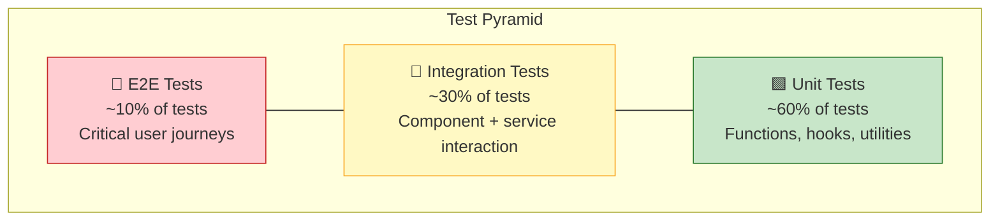

# 🧪 CarbonMind AI — Testing Documentation

> Comprehensive testing strategy, conventions, and execution guide for the CarbonMind AI platform.

---

## Table of Contents

- [Testing Philosophy](#testing-philosophy)
- [Test Pyramid](#test-pyramid)
- [Running Tests](#running-tests)
- [Coverage Requirements](#coverage-requirements)
- [Test File Conventions](#test-file-conventions)
- [Mocking Strategy](#mocking-strategy)
- [Testing Each Layer](#testing-each-layer)
- [Cloud Functions Testing](#cloud-functions-testing)
- [Accessibility Testing](#accessibility-testing)
- [CI/CD Integration](#cicd-integration)

---

## Testing Philosophy

CarbonMind AI follows a **pragmatic testing philosophy** that prioritizes:

1. **Confidence over coverage** — Tests should give confidence that the application works correctly, not just inflate coverage numbers
2. **Test behavior, not implementation** — Tests verify what the code does, not how it does it
3. **Fast feedback loops** — Unit tests run in seconds; integration tests run in under a minute
4. **Test the right things at the right level** — Use the test pyramid to guide where to invest testing effort

---

## Test Pyramid



### Layer Descriptions

| Layer | Scope | Tools | Speed | Quantity |
|-------|-------|-------|-------|----------|
| **Unit Tests** | Individual functions, hooks, utilities | Jest, React Testing Library | Fast (< 5s) | ~60% |
| **Integration Tests** | Component trees, Firebase interactions | Jest, Testing Library, Firebase Emulator | Medium (< 30s) | ~30% |
| **E2E Tests** | Full user journeys across pages | Playwright or Cypress | Slow (< 2min) | ~10% |

---

## Running Tests

### Quick Reference

```bash
# Run all unit and integration tests
npm test

# Run tests in watch mode (re-runs on file changes)
npm run test:watch

# Run tests with coverage report
npm run test:coverage

# Run a specific test file
npm test -- --testPathPattern="useAuth"

# Run tests matching a description
npm test -- -t "should calculate carbon score"

# Run only unit tests
npm test -- --testPathPattern="__tests__/unit"

# Run only integration tests
npm test -- --testPathPattern="__tests__/integration"
```

### Cloud Functions Tests

```bash
# Navigate to functions directory
cd functions

# Run function tests
npm test

# Run with coverage
npm run test:coverage

# Start Firebase emulator for integration tests
firebase emulators:start --only firestore,functions
```

### E2E Tests

```bash
# Run E2E tests headless
npm run test:e2e

# Run E2E tests with browser UI
npm run test:e2e:ui

# Run a specific E2E test
npx playwright test tests/e2e/login.spec.ts
```

### Linting and Formatting

```bash
# Run ESLint
npm run lint

# Fix auto-fixable lint issues
npm run lint:fix

# Check Prettier formatting
npx prettier --check .

# Fix Prettier formatting
npx prettier --write .
```

---

## Coverage Requirements

### Minimum Coverage Thresholds

| Metric | Threshold | Rationale |
|--------|-----------|-----------|
| **Statements** | 80% | Ensure most code paths are exercised |
| **Branches** | 75% | Cover conditional logic |
| **Functions** | 85% | All exported functions must be tested |
| **Lines** | 80% | General code coverage baseline |

### Coverage Configuration

```javascript
// jest.config.js
module.exports = {
  coverageThreshold: {
    global: {
      statements: 80,
      branches: 75,
      functions: 85,
      lines: 80,
    },
  },
  collectCoverageFrom: [
    "lib/**/*.{ts,tsx}",
    "hooks/**/*.{ts,tsx}",
    "components/**/*.{ts,tsx}",
    "app/**/*.{ts,tsx}",
    "!**/*.d.ts",
    "!**/node_modules/**",
    "!**/__tests__/**",
  ],
};
```

### Coverage Reporting

```bash
# Generate HTML coverage report
npm run test:coverage

# View report
# → Open coverage/lcov-report/index.html in browser

# Generate lcov report for CI
npm run test:coverage -- --coverageReporters=lcov
```

---

## Test File Conventions

### File Naming

| Pattern | Location | Purpose |
|---------|----------|---------|
| `*.test.ts` | `__tests__/unit/` | Unit tests for utilities and pure functions |
| `*.test.tsx` | `__tests__/unit/` | Unit tests for React components |
| `*.integration.test.ts` | `__tests__/integration/` | Integration tests with Firebase |
| `*.spec.ts` | `tests/e2e/` | End-to-end tests |

### Directory Structure

```
__tests__/
├── unit/
│   ├── lib/
│   │   ├── utils.test.ts
│   │   ├── gemini.test.ts
│   │   └── firebase/
│   │       ├── auth.test.ts
│   │       └── firestore.test.ts
│   ├── hooks/
│   │   ├── useAuth.test.ts
│   │   └── useCarbonData.test.ts
│   └── components/
│       ├── ActivityForm.test.tsx
│       ├── CarbonChart.test.tsx
│       └── LeaderboardTable.test.tsx
├── integration/
│   ├── activity-logging.integration.test.ts
│   ├── auth-flow.integration.test.ts
│   └── leaderboard.integration.test.ts
└── __mocks__/
    ├── firebase/
    │   ├── auth.ts
    │   └── firestore.ts
    └── next/
        ├── router.ts
        └── navigation.ts

tests/
└── e2e/
    ├── login.spec.ts
    ├── dashboard.spec.ts
    └── activity-log.spec.ts
```

### Test Structure (AAA Pattern)

All tests follow the **Arrange, Act, Assert** pattern:

```typescript
describe("calculateCarbonScore", () => {
  it("should return 100 for zero emissions", () => {
    // Arrange
    const totalMonthlyCarbon = 0;
    const baseline = 600;

    // Act
    const score = calculateCarbonScore(totalMonthlyCarbon, baseline);

    // Assert
    expect(score).toBe(100);
  });

  it("should return 0 when emissions exceed baseline", () => {
    // Arrange
    const totalMonthlyCarbon = 700;
    const baseline = 600;

    // Act
    const score = calculateCarbonScore(totalMonthlyCarbon, baseline);

    // Assert
    expect(score).toBe(0);
  });

  it("should clamp score between 0 and 100", () => {
    // Arrange & Act
    const highScore = calculateCarbonScore(-100, 600);
    const lowScore = calculateCarbonScore(1200, 600);

    // Assert
    expect(highScore).toBeLessThanOrEqual(100);
    expect(lowScore).toBeGreaterThanOrEqual(0);
  });
});
```

---

## Mocking Strategy

### Firebase Mocks

Firebase services are mocked at the module level to avoid network calls in unit tests:

```typescript
// __tests__/__mocks__/firebase/firestore.ts
export const mockCollection = jest.fn();
export const mockDoc = jest.fn();
export const mockGetDoc = jest.fn();
export const mockSetDoc = jest.fn();
export const mockAddDoc = jest.fn();
export const mockOnSnapshot = jest.fn();
export const mockQuery = jest.fn();
export const mockWhere = jest.fn();

jest.mock("firebase/firestore", () => ({
  collection: mockCollection,
  doc: mockDoc,
  getDoc: mockGetDoc,
  setDoc: mockSetDoc,
  addDoc: mockAddDoc,
  onSnapshot: mockOnSnapshot,
  query: mockQuery,
  where: mockWhere,
  getFirestore: jest.fn(),
  serverTimestamp: jest.fn(() => new Date()),
}));
```

```typescript
// __tests__/__mocks__/firebase/auth.ts
export const mockSignInWithPopup = jest.fn();
export const mockSignOut = jest.fn();
export const mockOnAuthStateChanged = jest.fn();

jest.mock("firebase/auth", () => ({
  getAuth: jest.fn(),
  signInWithPopup: mockSignInWithPopup,
  signOut: mockSignOut,
  onAuthStateChanged: mockOnAuthStateChanged,
  GoogleAuthProvider: jest.fn(),
}));
```

### Hook Mocking

Custom hooks are mocked to isolate component tests:

```typescript
// Mocking useAuth hook in component tests
jest.mock("@/hooks/useAuth", () => ({
  useAuth: () => ({
    user: { uid: "test-uid", displayName: "Test User", email: "test@example.com" },
    loading: false,
    signIn: jest.fn(),
    signOut: jest.fn(),
  }),
}));
```

### Gemini AI Mocking

```typescript
// Mock Gemini AI responses for deterministic tests
jest.mock("@/lib/gemini", () => ({
  generateCarbonInsights: jest.fn().mockResolvedValue({
    summary: "Your carbon footprint decreased by 15% this week.",
    recommendations: [
      "Consider cycling to work twice a week",
      "Switch to LED bulbs in remaining rooms",
    ],
    score: 82,
  }),
}));
```

### When to Use Real Services

| Scenario | Mock or Real? | Reason |
|----------|---------------|--------|
| Unit tests | **Mock** | Speed, isolation, determinism |
| Integration tests | **Firebase Emulator** | Realistic behavior without cloud costs |
| E2E tests | **Firebase Emulator** | Full stack validation |
| Performance tests | **Real (staging)** | Accurate latency measurements |

### Firebase Emulator for Integration Tests

```bash
# Start emulator suite
firebase emulators:start --only auth,firestore,functions

# Emulator ports:
# Auth:      http://localhost:9099
# Firestore: http://localhost:8080
# Functions: http://localhost:5001
# UI:        http://localhost:4000
```

```typescript
// Connect to emulators in test setup
import { connectFirestoreEmulator } from "firebase/firestore";
import { connectAuthEmulator } from "firebase/auth";

if (process.env.NODE_ENV === "test") {
  connectFirestoreEmulator(db, "localhost", 8080);
  connectAuthEmulator(auth, "http://localhost:9099");
}
```

---

## Testing Each Layer

### Utility Functions (`lib/`)

```typescript
// __tests__/unit/lib/utils.test.ts
import { formatCarbonValue, getCategoryColor, calculateStreak } from "@/lib/utils";

describe("formatCarbonValue", () => {
  it("formats kilograms with one decimal place", () => {
    expect(formatCarbonValue(12.456)).toBe("12.5 kg CO₂");
  });

  it("handles zero emissions", () => {
    expect(formatCarbonValue(0)).toBe("0.0 kg CO₂");
  });
});

describe("calculateStreak", () => {
  it("returns 0 for no activities", () => {
    expect(calculateStreak([])).toBe(0);
  });

  it("counts consecutive days correctly", () => {
    const today = new Date();
    const yesterday = new Date(today.getTime() - 86400000);
    const twoDaysAgo = new Date(today.getTime() - 172800000);

    expect(calculateStreak([today, yesterday, twoDaysAgo])).toBe(3);
  });
});
```

### React Components (`components/`)

```typescript
// __tests__/unit/components/ActivityForm.test.tsx
import { render, screen, fireEvent, waitFor } from "@testing-library/react";
import { ActivityForm } from "@/components/forms/ActivityForm";

describe("ActivityForm", () => {
  const mockOnSubmit = jest.fn();

  beforeEach(() => {
    mockOnSubmit.mockClear();
  });

  it("renders all category options", () => {
    render(<ActivityForm onSubmit={mockOnSubmit} />);

    expect(screen.getByText("Transport")).toBeInTheDocument();
    expect(screen.getByText("Energy")).toBeInTheDocument();
    expect(screen.getByText("Food")).toBeInTheDocument();
    expect(screen.getByText("Consumption")).toBeInTheDocument();
  });

  it("validates carbon emission range", async () => {
    render(<ActivityForm onSubmit={mockOnSubmit} />);

    const input = screen.getByLabelText(/carbon emission/i);
    fireEvent.change(input, { target: { value: "-5" } });
    fireEvent.submit(screen.getByRole("form"));

    await waitFor(() => {
      expect(screen.getByText(/must be a positive number/i)).toBeInTheDocument();
    });
    expect(mockOnSubmit).not.toHaveBeenCalled();
  });

  it("submits valid form data", async () => {
    render(<ActivityForm onSubmit={mockOnSubmit} />);

    fireEvent.change(screen.getByLabelText(/category/i), {
      target: { value: "transport" },
    });
    fireEvent.change(screen.getByLabelText(/carbon emission/i), {
      target: { value: "15" },
    });
    fireEvent.submit(screen.getByRole("form"));

    await waitFor(() => {
      expect(mockOnSubmit).toHaveBeenCalledWith(
        expect.objectContaining({
          category: "transport",
          carbonEmit: 15,
        })
      );
    });
  });
});
```

### Custom Hooks (`hooks/`)

```typescript
// __tests__/unit/hooks/useAuth.test.ts
import { renderHook, act } from "@testing-library/react";
import { useAuth } from "@/hooks/useAuth";
import { mockOnAuthStateChanged } from "../__mocks__/firebase/auth";

describe("useAuth", () => {
  it("starts in loading state", () => {
    mockOnAuthStateChanged.mockImplementation(() => () => {});
    const { result } = renderHook(() => useAuth());

    expect(result.current.loading).toBe(true);
    expect(result.current.user).toBeNull();
  });

  it("updates user when auth state changes", () => {
    const mockUser = { uid: "123", displayName: "Test User" };
    mockOnAuthStateChanged.mockImplementation((auth, callback) => {
      callback(mockUser);
      return () => {};
    });

    const { result } = renderHook(() => useAuth());

    expect(result.current.loading).toBe(false);
    expect(result.current.user).toEqual(mockUser);
  });
});
```

---

## Cloud Functions Testing

### Unit Testing Cloud Functions

```typescript
// functions/__tests__/index.test.ts
import * as admin from "firebase-admin";
import { onUserCreated } from "../src/index";

// Mock firebase-admin
jest.mock("firebase-admin", () => ({
  initializeApp: jest.fn(),
  firestore: jest.fn(() => ({
    doc: jest.fn(() => ({
      set: jest.fn().mockResolvedValue(undefined),
    })),
    collection: jest.fn(() => ({
      add: jest.fn().mockResolvedValue({ id: "test-achievement-id" }),
    })),
  })),
}));

describe("onUserCreated", () => {
  it("creates leaderboard entry for new user", async () => {
    const mockEvent = {
      data: {
        data: () => ({
          name: "Jane Doe",
          email: "jane@example.com",
          points: 50,
          carbonScore: 75,
        }),
      },
      params: { userId: "user-123" },
    };

    // Invoke the function handler
    await onUserCreated(mockEvent as any);

    // Verify leaderboard was created
    const db = admin.firestore();
    expect(db.doc).toHaveBeenCalledWith("leaderboard/user-123");
  });
});
```

### Integration Testing with Firebase Emulator

```typescript
// functions/__tests__/integration/activity.integration.test.ts
import * as admin from "firebase-admin";

// Connect to emulator
process.env.FIRESTORE_EMULATOR_HOST = "localhost:8080";
admin.initializeApp({ projectId: "cardon-footprint" });

describe("Activity aggregation (integration)", () => {
  const db = admin.firestore();

  afterEach(async () => {
    // Clean up emulator data
    const collections = await db.listCollections();
    for (const col of collections) {
      const docs = await col.listDocuments();
      for (const doc of docs) {
        await doc.delete();
      }
    }
  });

  it("recalculates monthly carbon on activity write", async () => {
    // Create user
    await db.doc("users/test-user").set({
      name: "Test User",
      carbonScore: 75,
      points: 50,
    });

    // Add activity
    await db.collection("activities").add({
      userId: "test-user",
      category: "transport",
      carbonEmit: 25,
      date: admin.firestore.Timestamp.now(),
    });

    // Wait for function trigger
    await new Promise((resolve) => setTimeout(resolve, 2000));

    // Verify user was updated
    const userDoc = await db.doc("users/test-user").get();
    expect(userDoc.data()?.monthlyCarbon).toBeDefined();
  });
});
```

---

## Accessibility Testing

### Automated Accessibility Tests

```typescript
// __tests__/unit/components/Dashboard.a11y.test.tsx
import { render } from "@testing-library/react";
import { axe, toHaveNoViolations } from "jest-axe";
import { Dashboard } from "@/app/(dashboard)/dashboard/page";

expect.extend(toHaveNoViolations);

describe("Dashboard accessibility", () => {
  it("should have no accessibility violations", async () => {
    const { container } = render(<Dashboard />);
    const results = await axe(container);
    expect(results).toHaveNoViolations();
  });
});
```

### Manual Testing Checklist

- [ ] Navigate entire app using keyboard only (Tab, Enter, Escape, Arrow keys)
- [ ] Test with screen reader (NVDA on Windows, VoiceOver on macOS)
- [ ] Verify focus is visible on all interactive elements
- [ ] Check color contrast ratios with browser DevTools
- [ ] Test at 200% browser zoom
- [ ] Verify `prefers-reduced-motion` disables animations

---

## CI/CD Integration

### GitHub Actions Workflow

```yaml
# .github/workflows/test.yml
name: Test Suite

on:
  push:
    branches: [main, develop]
  pull_request:
    branches: [main]

jobs:
  test:
    runs-on: ubuntu-latest

    steps:
      - uses: actions/checkout@v4

      - uses: actions/setup-node@v4
        with:
          node-version: "20"
          cache: "npm"

      - name: Install dependencies
        run: npm ci

      - name: Lint
        run: npm run lint

      - name: Type check
        run: npx tsc --noEmit

      - name: Unit & Integration tests
        run: npm run test:coverage

      - name: Upload coverage
        uses: codecov/codecov-action@v4
        with:
          file: coverage/lcov.info

      - name: Cloud Functions tests
        working-directory: functions
        run: |
          npm ci
          npm run build
          npm test
```

---

<p align="center">
  <em>Last updated: June 2025</em>
</p>
